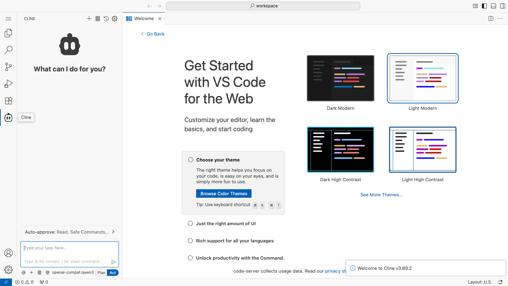
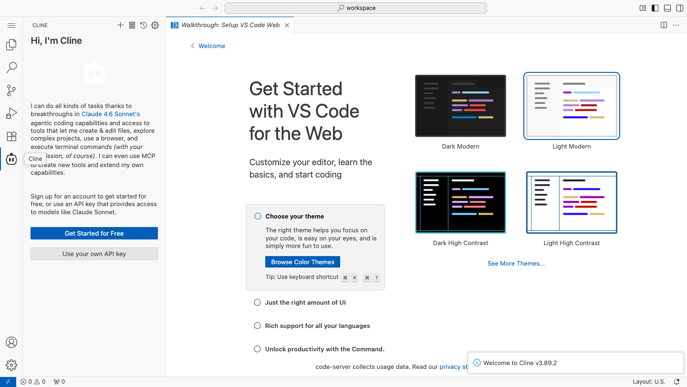
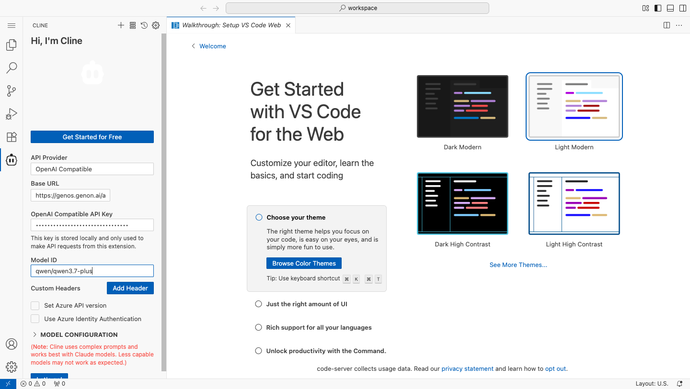
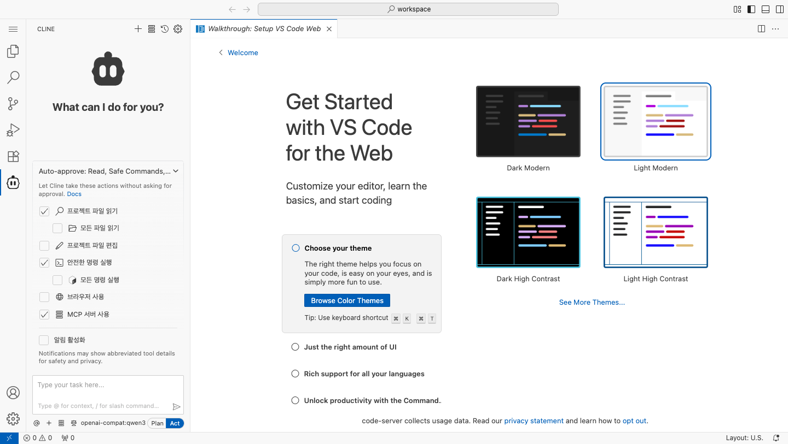
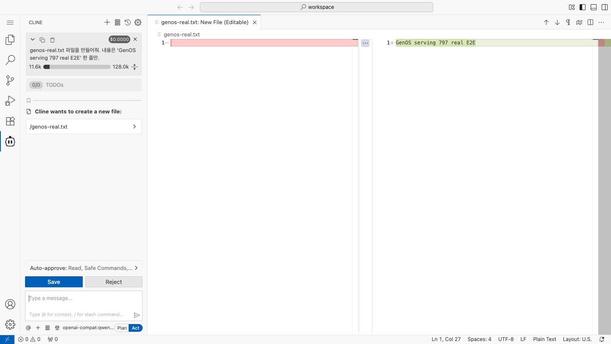
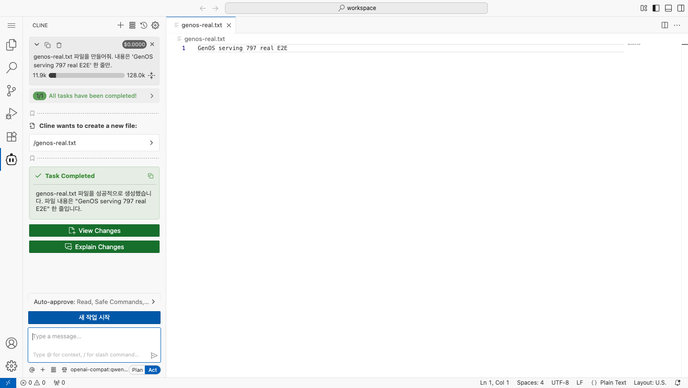

# 코드스페이스 코딩 에이전트(CLINE-for-Genos v2) QA 가이드

- 대상: GenOS PR [#13293](https://github.com/genonai/GenOS/pull/13293) — Cline v3.35.1 → v3.89.2 전환 + 파일 provisioning + CLI 동봉
- 릴리스: [v3.89.2-genos.2](https://github.com/genonai/cline-for-genos/releases/tag/v3.89.2-genos.2)
- 첨부 이미지는 개발 검증 시 캡처한 **기대 화면**이다. 각 시나리오의 실제 화면이 이미지와 동일한 구성인지 확인한다.

---

## 0. 사전 준비 — 검증 환경 2종

### A. 배포 코드스페이스 (운영/검증계 — **QA 기본 환경**)

GenOS에서 코드스페이스를 생성하고 평소처럼 접속한다 (docker 명령 불필요·불가).

> **현재 배포에는 서빙 env 자동 주입이 없다** (후속 이슈 #13294, admin-api/FE 연동 전).
> 따라서 배포 환경의 기본 사용 흐름은 **시나리오 2-A(설정 UI 수동 입력)** — v1과 동일한 사용자 경험이다.
> 시나리오 2-B(자동 설정)는 로컬 docker 검증 전용이며, #13294 적용 후 운영 기본 경로가 된다.

### B. 로컬 docker 단독 검증 (개발자 사전 검증 전용)

운영 접속 경로(nginx→user_proxy)는 GenOS 세션에 결합되어 있어, 로컬에서는 검증용 code-server를 외부 바인드로 추가 기동한다. **이 절차는 로컬 전용** — 배포 코드스페이스에서는 수행할 수 없고 할 필요도 없다.

```bash
# 이미지 빌드 (GenOS 레포 task/13261 체크아웃 기준)
cd container-services/codespace
docker build -f Dockerfile-codespace-slim -t codespace-slim:qa .

# env 자동 설정 모드 검증용 기동 (시나리오 2-B) — env 3종을 빼면 수동 설정 모드(2-A) 검증
docker run -d --name cs-qa -p 18084:8081 \
  -e JUPYTER_ENDPOINT=/jupyter \
  -e GENOS_SERVING_URL="{GenOS주소}/api/gateway/rep/serving/{서빙번호}/v1" \
  -e GENOS_SERVING_API_KEY="{서빙 API 키}" \
  -e GENOS_SERVING_MODEL_ID="{모델 ID}" \
  codespace-slim:qa
docker exec -d cs-qa code-server --bind-addr 0.0.0.0:8081 --auth none /workspace
# 브라우저: http://localhost:18084  (트러스트 다이얼로그가 뜨면 "Yes, I trust the authors")
```

### 환경변수 계약 (provisioning — 컨테이너 기동 시 1회 시딩)

| 변수 | 필수 | 효과 |
|---|---|---|
| `GENOS_SERVING_URL` | URL+KEY 둘 다 있을 때만 시딩 | API Provider=OpenAI Compatible + Base URL 사전 설정, 웰컴 스킵 |
| `GENOS_SERVING_API_KEY` | 〃 | API Key 사전 설정 (secrets.json 0600) |
| `GENOS_SERVING_MODEL_ID` | 선택 | 모델 ID 사전 설정 |
| `GENOS_CLINE_NTC=false` | 선택 | native tool calling 비활성 (문제 시 우회용) |

env 유무와 무관하게 폐쇄망 kill-switch(`~/.cline/endpoints.json`)와 텔레메트리 OFF는 항상 시딩된다.

---

## 시나리오 1 — 확장 로드 & 브랜딩

**기대 화면:**



| # | 확인 항목 | 기대 결과 | 확인 |
|---|---|---|---|
| 1-1 | 액티비티바에 로봇 아이콘(7번째) 존재, 툴팁 "Cline" | 표시됨 | ☐ |
| 1-2 | 아이콘 클릭 → 사이드바 패널 열림, 헤더 "CLINE" | **본문이 채팅 화면으로 렌더링** (빈 화면+무한 스피너면 즉시 결함 보고) | ☐ |
| 1-3 | 패널 타이틀바 버튼 | **4개**(새 태스크 +, MCP, 히스토리 ⏱, 설정 ⚙) — 계정(Account) 버튼 **없음** | ☐ |
| 1-4 | 우상단 알림 | "Welcome to Cline v3.89.2" 토스트 (최초 1회) | ☐ |
| 1-5 | 히스토리(⏱) 버튼 클릭 | 히스토리 뷰 전환 — **"command not found" 에러 토스트가 뜨면 결함** | ☐ |
| 1-6 | 확장 목록(Extensions 패널) | `CLINE-for-Genos` (publisher genon) v3.89.2 | ☐ |

## 시나리오 2 — 서빙 연결 설정

### 2-A. 설정 UI 수동 입력 — **현행 배포 기본 경로 (v1과 동일한 사용자 흐름)**

env 미주입 환경(현재 운영 코드스페이스 전부)에서 패널을 열면 웰컴 화면이 나온다:



절차: **"Use your own API key"** 클릭 → API Provider 입력란에 `openai` 타이핑(검색형 콤보박스) → **"OpenAI Compatible"** 선택 → 3개 필드 입력 → **"Let's go!"**


| 필드 | 입력 값 |
|---|---|
| Base URL | `{GenOS 접속주소}/api/gateway/rep/serving/{서빙번호}/v1` |
| OpenAI Compatible API Key | GenOS 서빙 API 키 |
| Model ID | 서빙 모델 ID (라우터형 서빙은 `/v1/models` 응답의 `id` 값) |



| # | 확인 항목 | 기대 결과 | 확인 |
|---|---|---|---|
| 2-1 | Provider 검색 | `openai` 타이핑 시 "OpenAI Compatible" 필터링·선택 가능 | ☐ |
| 2-2 | Let's go! 클릭 | 웰컴이 닫히고 채팅 화면 전환, 입력창 하단에 `openai-compat:{모델ID}` 배지 | ☐ |
| 2-3 | 설정 영속 | 코드스페이스 터미널에서 `cat ~/.cline/data/globalState.json` → `openAiBaseUrl` 기록 확인, `stat -c %a ~/.cline/data/secrets.json` → `600` | ☐ |
| 2-4 | (홈 영속 환경) 재접속 | 재설정 없이 그대로 사용 가능 | ☐ |

### 2-B. env 자동 주입 (로컬 docker 검증 전용 — #13294 적용 후 운영 기본)

| # | 확인 항목 | 기대 결과 | 확인 |
|---|---|---|---|
| 2-5 | 패널 첫 화면 | 웰컴 **없이** 바로 채팅 화면 + 모델 배지 (이미지 1 좌하단) | ☐ |
| 2-6 | 설정(⚙) → API Configuration | Base URL·Key·Model 사전 입력 상태 | ☐ |
| 2-7 | 설정을 임의 변경 후 컨테이너 재기동 | 변경값 보존 — 시딩이 기존 파일을 덮어쓰지 않음 | ☐ |

## 시나리오 3 — 한국어 UI (자동승인 메뉴)

채팅 입력창 위 `Auto-approve: ...` 바 클릭 → 펼침.

**기대 화면:**



| # | 확인 항목 | 기대 결과 | 확인 |
|---|---|---|---|
| 3-1 | 펼친 메뉴 라벨 8종 | 프로젝트 파일 읽기 / 모든 파일 읽기 / 프로젝트 파일 편집 / 안전한 명령 실행 / 모든 명령 실행 / 브라우저 사용 / MCP 서버 사용 / 알림 활성화 — **전부 한국어** | ☐ |
| 3-2 | 체크 토글 동작 | 클릭 시 즉시 반영, 에러 없음 | ☐ |
| 3-3 | 태스크 완료 후 버튼 | "새 작업 시작" (한국어) | ☐ |

> 한국어는 빌드 시 번들 치환 방식이라 upstream이 라벨을 바꾸면 일부 항목이 영문으로 보일 수 있다(기능 정상). 영문 fallback은 결함이 아니라 사전 보수 대상으로 보고.

## 시나리오 4 — 채팅 → 파일 생성 도구 루프 (핵심)

채팅에 입력: `genos-qa.txt 파일을 만들어줘. 내용은 'QA pass' 한 줄만.`

**기대 화면 (① 승인 게이트 → ② 완료):**





| # | 확인 항목 | 기대 결과 | 확인 |
|---|---|---|---|
| 4-1 | 모델 응답 | "Cline wants to create a new file:" 블록 + 본문 영역에 diff 에디터(초록 추가 라인) | ☐ |
| 4-2 | 승인 버튼 | Save / Reject 표시 ("프로젝트 파일 편집" 자동승인 OFF 기준) | ☐ |
| 4-3 | Save 클릭 | 파일 생성 (탐색기/터미널 `cat`으로 내용 일치 확인) | ☐ |
| 4-4 | 완료 | 초록 "Task Completed" 블록 + 상단 focus chain "1/1 All tasks have been completed!" | ☐ |
| 4-5 | 토큰/비용 표기 | 태스크 헤더에 토큰 게이지(예: 11.9k/128k) 표시 | ☐ |

> 모델이 도구 형식을 지키지 못해 "You did not use a tool" 재시도가 반복되면: 모델 변경 또는 `GENOS_CLINE_NTC=false` 재기동 후 재시도. (Qwen 계열은 XML 도구 모드 자동 적용 — 개발 검증에서 qwen3.6-27b 정상 확인)

## 시나리오 5 — 폐쇄망(phone-home 차단)

| # | 확인 항목 | 방법 | 기대 결과 | 확인 |
|---|---|---|---|---|
| 5-1 | selfHosted 모드 | `docker exec <컨테이너> cat /home/genos/.cline/endpoints.json` | 3개 URL 모두 `http://127.0.0.1:9` | ☐ |
| 5-2 | 텔레메트리 무력화 | code-server 로그(Output → Cline 채널)에서 | `Cline running in self-hosted mode` + `NoOpTelemetryProvider` | ☐ |
| 5-3 | 외부망 차단 기동 | `docker network create --internal iso && docker run --network iso ...` | 치명 에러 없이 기동·패널 동작 (LLM 호출만 실패) | ☐ |

## 시나리오 6 — Cline CLI

| # | 확인 항목 | 방법 | 기대 결과 | 확인 |
|---|---|---|---|---|
| 6-1 | CLI 설치 | 코드스페이스 터미널에서 `cline --version` | `3.0.24` | ☐ |
| 6-2 | 설정 공유 | `cline` 첫 기동 | 확장과 동일한 `~/.cline` 설정 사용 (서빙 재설정 불필요) | ☐ |

---

## 트러블슈팅 / 결함 분류

| 증상 | 의미 | 분류 |
|---|---|---|
| 패널 본문이 빈 화면 + 헤더에 무한 진행바 | 브랜딩이 빌드 전에 적용된 결함 빌드 (genos.1 계열) — 릴리스 태그가 `v3.89.2-genos.2` 이상인지 확인 | **Critical** |
| `command 'cline.*' not found` 토스트 | 위와 동일 원인 | **Critical** |
| 일부 라벨이 영문 | upstream 라벨 변경에 따른 i18n 사전 미매칭 — 기능 정상 | Minor (사전 보수) |
| 아이콘이 액티비티바에 안 보임 | 워크스페이스 트러스트 미승인 상태 — 트러스트 수락 후 표시 | 동작 사양 |
| 확장 내부에서 walkthrough 열기 실패 | 번들 내 딥링크가 upstream ID 기준 (알려진 한계, 명령 팔레트 경유는 정상) | Known |

문의/결함 등록: [genonai/cline-for-genos issues](https://github.com/genonai/cline-for-genos/issues) (확장 자체) / GenOS 이슈 #13261 참조 (컨테이너 통합)
